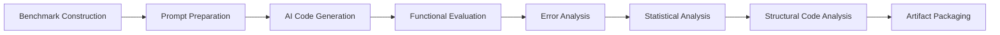

<div align="center">

# 🧠 AI-Code Judgement

### Evaluating the Functional Correctness and Consistency of AI-Generated Introductory Programming Solutions

### A Reproducible Experimental Framework for Computing Education Research

<p>


</p>

---

### 📚 Research Artifact

*A reproducible benchmark-driven framework for evaluating AI-generated introductory programming solutions using hidden test cases, structural code analysis, statistical evaluation, and educational interpretation.*

</div>

---

# 📌 Overview

Large Language Models (LLMs) such as ChatGPT are increasingly used by novice programmers to generate source code for introductory programming problems. While these systems frequently produce syntactically correct programs, educators still face important questions:

- Are AI-generated programs functionally correct?
- Does the same prompt consistently produce reliable solutions?
- What types of programming errors occur?
- Can educators trust these solutions in CS1 classrooms?

This repository presents a **reproducible experimental framework** for systematically evaluating AI-generated introductory programming solutions using benchmark problems, repeated code generation, hidden test cases, structural code analysis, statistical evaluation, and educational interpretation.

---

# 🎯 Research Objectives

This project aims to

- Evaluate the functional correctness of AI-generated introductory programming solutions.
- Investigate the consistency of repeated AI-generated responses.
- Analyze common programming errors produced by AI.
- Study structural characteristics of generated programs.
- Provide reproducible evidence for Computing Education research.

---

# ❓ Research Questions

### RQ1

Does the same Large Language Model generate consistent solutions for identical introductory programming prompts?

### RQ2

Are the generated solutions functionally correct when evaluated using hidden test cases?

### RQ3

What types of programming errors frequently occur in AI-generated introductory programming solutions?

### RQ4

How can these observations support educators in teaching introductory programming and AI-assisted code evaluation?

---

# ✨ Key Features

- ✅ Reproducible end-to-end experimental workflow
- ✅ Benchmark dataset for introductory programming
- ✅ Prompt preparation framework
- ✅ AI-generated program evaluation
- ✅ Hidden test case assessment
- ✅ Automated error analysis
- ✅ Statistical analysis
- ✅ Structural code metrics using AST
- ✅ Publication-quality visualizations
- ✅ Research-ready documentation
- ✅ Eight Jupyter notebooks
- ✅ Designed for Computing Education research

---

# 🔬 Experimental Workflow



---

# 📂 Repository Structure

```text
AI-Code_Judgement
│
├── dataset/               Benchmark programming problems
├── prompts/               Prompt templates
├── generated_code/        AI-generated Python programs
├── evaluation/            Hidden test cases and evaluation
├── results/               Experimental results
├── figures/               Publication-quality figures
├── notebooks/             Eight Jupyter notebooks
├── docs/                  Supporting documentation
├── paper/                 ACM COMPUTE manuscript
│
├── README.md
├── LICENSE
├── requirements.txt
├── CITATION.cff
```

---

# 🚀 Experimental Pipeline

| Notebook | Description |
|-----------|-------------|
| Notebook 1 | Benchmark Construction |
| Notebook 2 | Prompt Preparation |
| Notebook 3 | AI Code Generation |
| Notebook 4 | Functional Evaluation |
| Notebook 5 | Error Analysis and Consistency |
| Notebook 6 | Visualization and Statistical Analysis |
| Notebook 7 | Structural Code Analysis and Educational Interpretation |
| Notebook 8 | Artifact Packaging and Reproducibility |

---

# ⚡ Quick Start

Clone the repository

```bash
git clone https://github.com/vkchennuru/AI-Code_Judgement.git
```

Move into the project

```bash
cd AI-Code_Judgement
```

Install dependencies

```bash
pip install -r requirements.txt
```

Launch Jupyter Notebook

```bash
jupyter notebook
```

Execute the notebooks sequentially from **Notebook 1** through **Notebook 8** to reproduce the complete experimental workflow.

---

# 🌍 Why This Repository?

Unlike repositories that only demonstrate AI-generated code examples, this project provides a complete research workflow that combines benchmark construction, prompt preparation, repeated AI code generation, automated functional evaluation, structural analysis, statistical summaries, and educational interpretation. The emphasis on reproducibility enables researchers and educators to verify the methodology, reproduce the experiments, and extend the work for future studies in Computing Education.

---

<div align="center">

## ⭐ If you find this repository useful,

please consider giving it a **Star** ⭐

Research collaborations, suggestions, and constructive feedback are always welcome.

</div>
