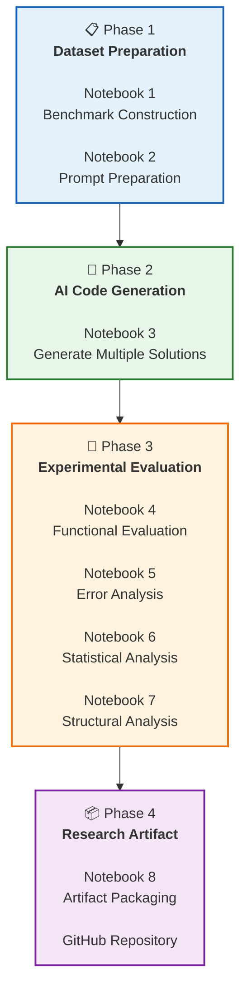

<div align="center">

# 🧠 AI-Code Judgement

### Evaluating the Functional Correctness and Consistency of AI-Generated Introductory Programming Solutions

### A Reproducible Experimental Framework for Computing Education Research

<p>


</p>

---

### 📚 Research Artifact

*A reproducible benchmark-driven framework for evaluating AI-generated introductory programming solutions using hidden test cases, structural code analysis, statistical evaluation, and educational interpretation.*

</div>

---

# 📌 Overview

Large Language Models (LLMs) such as ChatGPT are increasingly used by novice programmers to generate source code for introductory programming problems. While these systems frequently produce syntactically correct programs, educators still face important questions:

- Are AI-generated programs functionally correct?
- Does the same prompt consistently produce reliable solutions?
- What types of programming errors occur?
- Can educators trust these solutions in CS1 classrooms?

This repository presents a **reproducible experimental framework** for systematically evaluating AI-generated introductory programming solutions using benchmark problems, repeated code generation, hidden test cases, structural code analysis, statistical evaluation, and educational interpretation.

---

# 🎯 Research Objectives

This project aims to

- Evaluate the functional correctness of AI-generated introductory programming solutions.
- Investigate the consistency of repeated AI-generated responses.
- Analyze common programming errors produced by AI.
- Study structural characteristics of generated programs.
- Provide reproducible evidence for Computing Education research.

---

# ❓ Research Questions

### RQ1

Does the same Large Language Model generate consistent solutions for identical introductory programming prompts?

### RQ2

Are the generated solutions functionally correct when evaluated using hidden test cases?

### RQ3

What types of programming errors frequently occur in AI-generated introductory programming solutions?

### RQ4

How can these observations support educators in teaching introductory programming and AI-assisted code evaluation?

---

# ✨ Key Features

- ✅ Reproducible end-to-end experimental workflow
- ✅ Benchmark dataset for introductory programming
- ✅ Prompt preparation framework
- ✅ AI-generated program evaluation
- ✅ Hidden test case assessment
- ✅ Automated error analysis
- ✅ Statistical analysis
- ✅ Structural code metrics using AST
- ✅ Publication-quality visualizations
- ✅ Research-ready documentation
- ✅ Eight Jupyter notebooks
- ✅ Designed for Computing Education research

---

# 🔬 Experimental Workflow



---

# 📂 Repository Structure

```text
AI-Code_Judgement
│
├── dataset/               Benchmark programming problems
├── prompts/               Prompt templates
├── generated_code/        AI-generated Python programs
├── evaluation/            Hidden test cases and evaluation
├── results/               Experimental results
├── figures/               Publication-quality figures
├── notebooks/             Eight Jupyter notebooks
├── docs/                  Supporting documentation
├── paper/                 ACM COMPUTE manuscript
│
├── README.md
├── LICENSE
├── requirements.txt
├── CITATION.cff
```

---

# 🚀 Experimental Pipeline

| Notebook | Description |
|-----------|-------------|
| Notebook 1 | Benchmark Construction |
| Notebook 2 | Prompt Preparation |
| Notebook 3 | AI Code Generation |
| Notebook 4 | Functional Evaluation |
| Notebook 5 | Error Analysis and Consistency |
| Notebook 6 | Visualization and Statistical Analysis |
| Notebook 7 | Structural Code Analysis and Educational Interpretation |
| Notebook 8 | Artifact Packaging and Reproducibility |

---

# ⚡ Quick Start

Clone the repository

```bash
git clone https://github.com/vkchennuru/AI-Code_Judgement.git
```

Move into the project

```bash
cd AI-Code_Judgement
```

Install dependencies

```bash
pip install -r requirements.txt
```

Launch Jupyter Notebook

```bash
jupyter notebook
```

Execute the notebooks sequentially from **Notebook 1** through **Notebook 8** to reproduce the complete experimental workflow.

---

# 🌍 Why This Repository?

Unlike repositories that only demonstrate AI-generated code examples, this project provides a complete research workflow that combines benchmark construction, prompt preparation, repeated AI code generation, automated functional evaluation, structural analysis, statistical summaries, and educational interpretation. The emphasis on reproducibility enables researchers and educators to verify the methodology, reproduce the experiments, and extend the work for future studies in Computing Education.

---

<div align="center">

## ⭐ If you find this repository useful,

please consider giving it a **Star** ⭐

Research collaborations, suggestions, and constructive feedback are always welcome.

</div>

---

# 🧪 Experimental Methodology

The experimental framework follows a systematic and reproducible workflow to evaluate AI-generated introductory programming solutions.

The methodology consists of eight sequential stages:

1. Benchmark Construction
2. Prompt Preparation
3. AI Code Generation
4. Functional Evaluation
5. Error Analysis
6. Statistical Analysis
7. Structural Code Analysis
8. Artifact Packaging

Each stage is implemented as an independent Jupyter Notebook, allowing the complete experiment to be reproduced from raw benchmark problems to final research artifacts.

---

# 📊 Experimental Design

| Component | Description |
|-----------|-------------|
| Programming Language | Python |
| Domain | Introductory Programming (CS1) |
| Benchmark Problems | Introductory Programming Problems |
| AI-generated Programs | Multiple responses per problem |
| Evaluation Strategy | Hidden Test Cases |
| Structural Analysis | Python AST |
| Statistical Analysis | Automated |
| Visualizations | Publication-quality Figures |
| Environment | Jupyter Notebook |

---

# 📁 Notebook Descriptions

## 📘 Notebook 1 – Benchmark Construction

Constructs the benchmark dataset consisting of introductory programming problems.

### Outputs

- Benchmark dataset
- Problem metadata

---

## 📘 Notebook 2 – Prompt Preparation

Creates standardized prompts for AI-assisted code generation.

### Outputs

- Prompt templates
- Prompt repository

---

## 📘 Notebook 3 – AI Code Generation

Generates multiple AI solutions for every benchmark problem.

### Outputs

- Generated Python programs
- Organized repository of solutions

---

## 📘 Notebook 4 – Functional Evaluation

Evaluates generated programs using hidden test cases.

### Outputs

- Execution results
- Pass/Fail statistics
- Evaluation dataset

---

## 📘 Notebook 5 – Error Analysis

Performs detailed analysis of generated solutions.

### Outputs

- Error categories
- Consistency analysis
- Educational findings

---

## 📘 Notebook 6 – Statistical Analysis

Produces descriptive statistics and publication-quality visualizations.

### Outputs

- Statistical summaries
- Graphs
- Research figures

---

## 📘 Notebook 7 – Structural Code Analysis

Analyzes generated programs using Python Abstract Syntax Trees (AST).

### Outputs

- Structural metrics
- Complexity analysis
- Educational interpretation

---

## 📘 Notebook 8 – Artifact Packaging

Packages the complete experiment as a reproducible research artifact.

### Outputs

- requirements.txt
- LICENSE
- CITATION.cff
- artifact documentation
- reproducibility checklist

---

# 📈 Experimental Outputs

The repository automatically generates

- Benchmark Dataset
- Prompt Collection
- AI-generated Programs
- Evaluation Results
- Error Analysis Reports
- Statistical Summaries
- Structural Metrics
- Publication-quality Figures
- Reproducibility Documentation

---

# 📊 Research Figures

The repository generates publication-ready figures for the ACM COMPUTE paper.

Example outputs include:

- Functional Correctness Analysis
- Problem-wise Pass Rate
- Error Type Distribution
- Consistency Analysis
- Execution Statistics
- Structural Metrics

> **Note:** Figures are available in the `figures/` directory.

---

# 🔁 Reproducibility

To reproduce the complete experiment:

1. Clone the repository.
2. Install all dependencies.
3. Execute the notebooks sequentially.
4. Compare the generated outputs with those included in the repository.

Execution Order

Notebook 1 → Notebook 2 → Notebook 3 → Notebook 4 → Notebook 5 → Notebook 6 → Notebook 7 → Notebook 8

---

# 💻 Software Requirements

- Python 3.12
- Jupyter Notebook
- pandas
- numpy
- matplotlib

Additional dependencies are listed in `requirements.txt`.

---

# 📂 Repository Outputs

After successful execution, the repository produces:

```text
dataset/

generated_code/

evaluation/

results/

figures/

documentation/

publication tables

publication figures

artifact package
```

---

# 🎓 Educational Significance

This repository is intended to support:

- Computing Education researchers
- Computer Science educators
- AI-assisted programming research
- Reproducible research studies
- Introductory programming instruction
- Benchmark development
- Program analysis research

The workflow can also serve as a reusable experimental framework for future studies investigating AI-generated programming solutions in educational settings.

---
---

# 📚 Citation

If you use this repository, benchmark, methodology, or any part of the experimental framework in your research, please cite both the accompanying research paper (when published) and this repository.

## Repository Citation

```bibtex
@software{Krishnaveni2026_AICodeJudgement,
  author       = {Chennuru, Venkata Krishnaveni},
  title        = {AI-Code Judgement: A Reproducible Framework for Evaluating AI-Generated Introductory Programming Solutions},
  year         = {2026},
  publisher    = {GitHub},
  url          = {https://github.com/vkchennuru/AI-Code_Judgement}
}
```

> **Note:** Once the repository is archived on Zenodo, this citation will be updated with the DOI.

---

# 📄 Related Publication

**Title**

> *Evaluating the Functional Correctness and Consistency of AI-Generated Introductory Programming Solutions for Computing Education*

**Conference**

ACM COMPUTE 2026 *(Manuscript under preparation)*

The GitHub repository serves as the reproducible research artifact accompanying the conference submission.

---

# 🔄 Reproducibility Statement

This repository has been developed to support transparent and reproducible Computing Education research.

Researchers should be able to:

- Reproduce the complete experimental workflow
- Verify the reported results
- Extend the benchmark dataset
- Compare additional Large Language Models
- Apply the methodology to new programming problems

The repository is organized to encourage reuse, verification, and future extensions.

---

# 🌱 Future Work

This project provides a foundation for future research in AI-assisted programming and Computing Education.

Potential directions include:

- Expanding the benchmark with additional CS1 and CS2 programming problems
- Comparing multiple Large Language Models
- Evaluating prompt engineering strategies
- Investigating code quality beyond functional correctness
- Studying the impact of AI-generated code on student learning
- Integrating automated code quality metrics
- Developing educator-oriented evaluation dashboards

Researchers are encouraged to build upon this framework.

---

# 🤝 Contributing

Contributions that improve the quality and reproducibility of this repository are welcome.

Examples include:

- Additional benchmark problems
- Improved hidden test cases
- Bug fixes
- Documentation improvements
- New evaluation metrics
- Educational case studies

Before submitting major changes, please open an issue describing the proposed contribution.

---

# 🐞 Reporting Issues

If you discover an issue or identify an error, please create a GitHub Issue with:

- Description of the problem
- Steps to reproduce
- Expected behavior
- Actual behavior
- Suggested improvement (if available)

Constructive feedback from educators and researchers is highly appreciated.

---

# ❓ Frequently Asked Questions (FAQ)

### Is this repository intended for beginners?

Yes. The benchmark consists of introductory programming (CS1) problems suitable for novice programmers and Computing Education research.

---

### Which programming language is used?

Python is used throughout the experimental workflow.

---

### Can I reuse the benchmark?

Yes, subject to the repository license. Please provide appropriate citation.

---

### Can I contribute additional benchmark problems?

Certainly. Contributions that improve benchmark diversity and educational value are encouraged.

---

### Can this framework evaluate other Large Language Models?

Yes.

The experimental workflow is model-independent and can be extended to evaluate additional AI coding assistants.

---

# 📜 License

This project is released under the **MIT License**.

You are free to use, modify, and distribute the software in accordance with the license terms.

Please provide appropriate attribution when using this work in research or educational settings.

---

# 👩‍💻 About the Author

**Dr. C. V. Krishnaveni**

Lecturer in Computer Science

SKR & SKR Government College for Women (Autonomous)

Kadapa, Andhra Pradesh, India

**Research Interests**

- Computing Education
- Artificial Intelligence
- Machine Learning
- Program Analysis
- Educational Data Mining
- Reproducible Research

---

# 📬 Contact

For research collaborations, academic discussions, or suggestions:

- GitHub: https://github.com/vkchennuru
- Email: *(Add your academic email here)*
- ORCID: *(Add your ORCID here when available)*
- Google Scholar: *(Add your profile link when available)*

---

# 🙏 Acknowledgements

The author gratefully acknowledges the open-source scientific computing community whose tools and libraries made this work possible.

Special appreciation is extended to the broader Computing Education research community for promoting reproducible and transparent research practices.

---

<div align="center">

# ⭐ Support the Project

If you find this repository useful for your research or teaching,

please consider giving it a **⭐ Star** on GitHub.

Your support helps improve the visibility of reproducible Computing Education research.

---

### 💡 "Reproducibility transforms experiments into scientific contributions."

---

**Thank you for visiting this repository.**

Contributions, suggestions, collaborations, and constructive feedback are always welcome.

</div>

